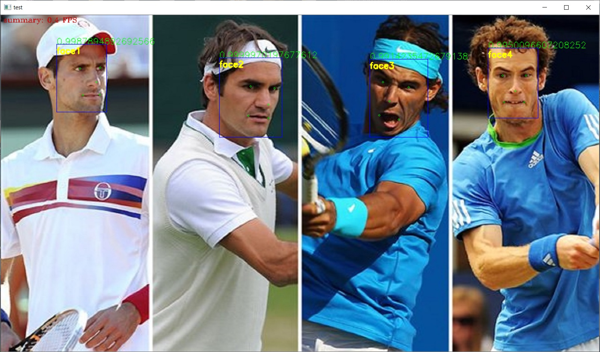

# Face Recognition Using MTCNN & FACENET Python* Demo

This demo demonstrates how to run mtcnn and facenet models using OpenVINO&trade;. The following pre-trained models can be used:

* `mtcnn`.
* `facenet-20180408-102900`.

For more information about the pre-trained models, refer to the [model documentation](../../../models/public/index.md).

## How It Works

The demo application expects mtcnn and facenet models in the Intermediate Representation (IR) format.

The demo workflow is the following:

1. Use mtcnn model to detect face position and feature points.
2. Use facenet to calculate the distance between the faces detected by mtcnn and the faces in the reference folder.
3. If the distance is less than the settable threshold, a matching face is found.

> **NOTE**: By default, Open Model Zoo demos expect input with BGR channels order. If you trained your model to work with RGB order, you need to manually rearrange the default channels order in the demo application or reconvert your model using the Model Optimizer tool with `--reverse_input_channels` argument specified. For more information about the argument, refer to **When to Reverse Input Channels** section of [Converting a Model Using General Conversion Parameters](https://docs.openvinotoolkit.org/latest/_docs_MO_DG_prepare_model_convert_model_Converting_Model_General.html).

## Running

Run the application with the `-h` option to see the following usage message:

```
usage: face_recognition_demo_mtcnn+facenet.py [-h] [-i INPUT] 
                                              [-mp MODEL_PNET]
                                              [-mr MODEL_RNET]
                                              [-mo MODEL_ONET]
                                              [-mf MODEL_FACENET]
                                              [-r REFERENCE] [-th THRESHOLD]
                                              [-d DEVICE]

Options:
  -h, --help            Show this help message and exit.
  -i INPUT, --input INPUT
                        Required. Path to a test image file.
  -mp MODEL_PNET, --model_pnet MODEL_PNET
                        Required. Path to an .xml file with a pnet model.
  -mr MODEL_RNET, --model_rnet MODEL_RNET
                        Required. Path to an .xml file with a rnet model.
  -mo MODEL_ONET, --model_onet MODEL_ONET
                        Required. Path to an .xml file with a onet model.
  -mf MODEL_FACENET, --model_facenet MODEL_FACENET
                        Required. Path to an .xml file with a facenet model.
  -r REFERENCE, --reference REFERENCE
                        Required. Path to the folder of reference image.
  -th THRESHOLD, --threshold THRESHOLD
                        Optional. The threshold to define the face is
                        recognized or not.
  -d DEVICE, --device DEVICE
                        Optional. Specify the target device to infer on; CPU,
                        GPU, FPGA, HDDL, MYRIAD or HETERO: is acceptable. The
                        sample will look for a suitable plugin for device
                        specified. Default value is CPU

```

Running the application with an empty list of options yields the short version of the usage message and an error message.

To run the demo, you can use public or pre-trained models. To download the pre-trained models, use the OpenVINO [Model Downloader](../../../tools/downloader/README.md) or go to [https://download.01.org/opencv/](https://download.01.org/opencv/).

> **NOTE**: Before running the demo with a trained model, make sure the model is converted to the Inference Engine format (`*.xml` + `*.bin`) using the [Model Optimizer tool](https://docs.openvinotoolkit.org/latest/_docs_MO_DG_Deep_Learning_Model_Optimizer_DevGuide.html).
To run the demo, please provide paths to the model in the IR format, and to an input video or image(s):
```bash
python face_recognition_demo_mtcnn+facenet.py \
-mp /home/user/mtcnn-p.xml \
-mo /home/user/mtcnn-o.xml \
-mr /home/user/mtcnn-r.xml \
-mf /home/user/facenet-20180408-102900.xml \
-i /home/user/image_name.jpg \
-r /home/user/reference_folder \
-th 0.7
```

## Demo Output

The application uses OpenCV to display found faces' boundary and feature points, recognized results, and current inference performance.



## See Also
* [Using Open Model Zoo demos](../../README.md)
* [Model Optimizer](https://docs.openvinotoolkit.org/latest/_docs_MO_DG_Deep_Learning_Model_Optimizer_DevGuide.html)
* [Model Downloader](../../../tools/downloader/README.md)
